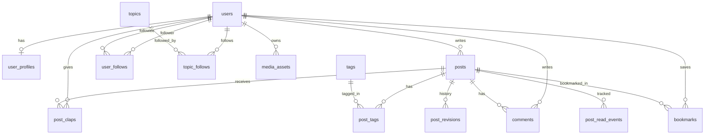

# Cơ sở dữ liệu — Blog kiểu Medium (production-oriented)

Tài liệu mô tả **các bảng cốt lõi** cho nền tảng đọc/viết bài dạng Medium: người dùng, bài viết, tương tác (clap, bình luận), theo dõi, tag, và dữ liệu hỗ trợ vận hành. Có thể triển khai trên **PostgreSQL** (khuyến nghị) hoặc MySQL 8+ với chỉnh sửa kiểu dữ liệu tương ứng.

---

## 1. Phạm vi chức năng chính

| Chức năng | Bảng liên quan |
|-----------|----------------|
| Đăng ký / đăng nhập / hồ sơ | `users`, `user_profiles` |
| Bài viết (draft, publish, slug) | `posts`, `post_revisions` (tùy chọn) |
| Tag & phân loại | `tags`, `post_tags` |
| Clap / reaction | `post_claps` |
| Bình luận (thread) | `comments` |
| Theo dõi tác giả / chủ đề | `user_follows`, `topic_follows` |
| Bookmark / reading list | `bookmarks` |
| Thống kê đọc (cơ bản) | `post_read_events` hoặc aggregate trên `posts` |
| Media đính kèm | `media_assets` |

**Ngoài phạm vi tối thiểu** (có thể bổ sung sau): thanh toán, newsletter, moderation queue, notification inbox, publication/team (tổ chức nhiều tác giả).

---

## 2. Sơ đồ quan hệ (Mermaid)

---

## 3. Quy ước chung (production)

- **Khóa chính**: `id` kiểu `UUID` (hoặc `BIGSERIAL` nếu ưu tiên hiệu năng insert đơn giản); dùng thống nhất một kiểu trong toàn hệ thống.
- **Thời gian**: `created_at`, `updated_at` (`TIMESTAMPTZ`); bài publish thêm `published_at`.
- **Soft delete**: cột `deleted_at` trên `users`, `posts`, `comments` nếu cần khôi phục / audit (nullable).
- **Slug**: `UNIQUE` trong phạm vi hợp lệ (ví dụ `UNIQUE (user_id, slug)` cho bài của user, hoặc `UNIQUE (slug)` nếu slug global).
- **Full-text search**: PostgreSQL `tsvector` / GIN index trên `title` + `excerpt` + nội dung rút gọn, hoặc dịch vụ ngoài (OpenSearch, Typesense).
- **Nội dung dài**: lưu HTML/Markdown trong `posts.body` hoặc tách `body` sang object storage + chỉ lưu URL/version trong DB.

---

## 4. Định nghĩa bảng

### 4.1 `users`

Xác định tài khoản đăng nhập. Chi tiết auth (hash mật khẩu, provider OAuth) có thể tách bảng `auth_identities` nếu đa provider.

| Cột | Kiểu | Ràng buộc / ghi chú |
|-----|------|---------------------|
| `id` | UUID / BIGSERIAL | PK |
| `email` | VARCHAR(320) | UNIQUE, NOT NULL (hoặc nullable nếu chỉ OAuth) |
| `email_verified_at` | TIMESTAMPTZ | NULL nếu chưa verify |
| `password_hash` | VARCHAR(255) | NULL nếu chỉ social login |
| `role` | VARCHAR(32) | `reader`, `writer`, `admin` — hoặc bảng `roles` + `user_roles` nếu phức tạp |
| `status` | VARCHAR(32) | `active`, `suspended`, `deleted` |
| `created_at`, `updated_at` | TIMESTAMPTZ | NOT NULL |
| `deleted_at` | TIMESTAMPTZ | optional soft delete |

**Index**: `UNIQUE (email)` WHERE `deleted_at IS NULL`; `(status, created_at)` cho admin.

---

### 4.2 `user_profiles`

Hồ sơ hiển thị công khai (tách khỏi `users` để giảm độ rộng bảng đăng nhập).

| Cột | Kiểu | Ghi chú |
|-----|------|---------|
| `user_id` | UUID / BIGINT | PK, FK → `users.id` |
| `display_name` | VARCHAR(100) | |
| `username` | VARCHAR(50) | UNIQUE, NOT NULL — URL `@username` |
| `bio` | TEXT | |
| `avatar_url` | VARCHAR(2048) | |
| `created_at`, `updated_at` | TIMESTAMPTZ | |

**Index**: `UNIQUE (username)`.

---

### 4.3 `posts`

Bài viết (draft và published dùng chung bảng, phân biệt bằng `status`).

| Cột | Kiểu | Ghi chú |
|-----|------|---------|
| `id` | UUID / BIGSERIAL | PK |
| `author_id` | UUID / BIGINT | FK → `users.id`, NOT NULL |
| `title` | VARCHAR(500) | NOT NULL |
| `slug` | VARCHAR(200) | NOT NULL — kết hợp UNIQUE với `author_id` hoặc global |
| `subtitle` | VARCHAR(500) | optional |
| `excerpt` | VARCHAR(500) | SEO / preview |
| `body` | TEXT | hoặc reference tới storage |
| `cover_image_url` | VARCHAR(2048) | |
| `status` | VARCHAR(32) | `draft`, `published`, `archived` |
| `published_at` | TIMESTAMPTZ | NULL khi draft |
| `reading_time_minutes` | SMALLINT | có thể tính khi publish |
| `clap_count` | BIGINT | denormalized — cập nhật từ `post_claps` (trigger/job) |
| `comment_count` | INT | denormalized |
| `view_count` | BIGINT | từ aggregate hoặc job định kỳ |
| `created_at`, `updated_at` | TIMESTAMPTZ | |
| `deleted_at` | TIMESTAMPTZ | optional |

**Index**:

- `UNIQUE (author_id, slug)` hoặc `UNIQUE (slug)` tùy quy ước URL.
- `(status, published_at DESC)` — feed published.
- `(author_id, status, updated_at DESC)` — dashboard tác giả.
- Full-text: GIN trên `to_tsvector(...)` nếu dùng PostgreSQL.

---

### 4.4 `post_revisions` (khuyến nghị cho production editor)

Lịch sử phiên bản autosave / khôi phục.

| Cột | Kiểu | Ghi chú |
|-----|------|---------|
| `id` | UUID / BIGSERIAL | PK |
| `post_id` | UUID / BIGINT | FK → `posts.id`, ON DELETE CASCADE |
| `title`, `body`, ... | giống snapshot | hoặc JSONB `snapshot` |
| `created_by` | UUID / BIGINT | FK → `users.id` |
| `created_at` | TIMESTAMPTZ | |

**Index**: `(post_id, created_at DESC)`.

---

### 4.5 `tags` & `post_tags`

| `tags` | |
|--------|--|
| `id` | PK |
| `name` | VARCHAR(100), UNIQUE |
| `slug` | VARCHAR(100), UNIQUE |

| `post_tags` | |
|-------------|--|
| `post_id` | FK → `posts.id`, ON DELETE CASCADE |
| `tag_id` | FK → `tags.id`, ON DELETE CASCADE |

**PK**: `(post_id, tag_id)`. **Index**: `(tag_id)` để list bài theo tag.

---

### 4.6 `topics` (tùy chọn — “chủ đề” giống Medium)

Nếu chỉ dùng tag thì có thể bỏ `topics` và `topic_follows`.

| Cột | Kiểu |
|-----|------|
| `id` | PK |
| `name`, `slug` | UNIQUE |
| `description` | TEXT |

Liên kết bài–chủ đề: `post_topics(post_id, topic_id)` tương tự `post_tags`.

---

### 4.7 `post_claps`

Medium: một user có thể clap nhiều lần (1–50). Lưu **tổng số clap per user per post** để tránh hàng nghìn dòng.

| Cột | Kiểu | Ghi chú |
|-----|------|---------|
| `post_id` | FK | |
| `user_id` | FK | |
| `count` | SMALLINT | CHECK `count BETWEEN 1 AND 50` |
| `updated_at` | TIMESTAMPTZ | |

**PK / UNIQUE**: `(post_id, user_id)`.

---

### 4.8 `comments`

Thread: `parent_id` NULL = comment gốc; khác NULL = reply.

| Cột | Kiểu | Ghi chú |
|-----|------|---------|
| `id` | PK | |
| `post_id` | FK → `posts.id`, ON DELETE CASCADE | |
| `user_id` | FK → `users.id` | |
| `parent_id` | FK → `comments.id`, NULL | ON DELETE CASCADE hoặc SET NULL |
| `body` | TEXT | NOT NULL |
| `created_at`, `updated_at` | TIMESTAMPTZ | |
| `deleted_at` | TIMESTAMPTZ | soft delete nội dung |

**Index**: `(post_id, created_at)`, `(parent_id)`.

---

### 4.9 `user_follows`

User A theo dõi user B.

| Cột | Kiểu |
|-----|------|
| `follower_id` | FK → `users.id` |
| `followee_id` | FK → `users.id` |

**UNIQUE** `(follower_id, followee_id)`; **CHECK** `follower_id <> followee_id`.

**Index**: `(followee_id)` cho danh sách follower.

---

### 4.10 `topic_follows`

| Cột | Kiểu |
|-----|------|
| `user_id` | FK |
| `topic_id` | FK |

**UNIQUE** `(user_id, topic_id)`.

---

### 4.11 `bookmarks`

| Cột | Kiểu |
|-----|------|
| `user_id` | FK |
| `post_id` | FK |

**UNIQUE** `(user_id, post_id)`; **Index** `(user_id, created_at DESC)` nếu có cột `created_at`.

---

### 4.12 `post_read_events` (tùy chọn — analytics chuẩn)

Ghi event raw cho funnel; aggregate sang `posts.view_count` bằng batch để giảm tải.

| Cột | Kiểu |
|-----|------|
| `id` | BIGSERIAL |
| `post_id` | FK |
| `user_id` | FK, NULL (guest) |
| `session_id` | VARCHAR(64) |
| `read_ratio` | NUMERIC(3,2) | 0–1, scroll depth |
| `created_at` | TIMESTAMPTZ |

**Index**: `(post_id, created_at)`; partition theo tháng nếu volume lớn.

**Thay thế đơn giản**: chỉ tăng `view_count` khi mở bài (kém chính xác hơn nhưng ít storage).

---

### 4.13 `media_assets`

Ảnh upload cho editor / avatar (metadata trong DB, file trên S3/R2).

| Cột | Kiểu |
|-----|------|
| `id` | PK |
| `owner_id` | FK → `users.id` |
| `storage_key` | VARCHAR(512) | UNIQUE |
| `url` | VARCHAR(2048) | |
| `mime_type` | VARCHAR(128) | |
| `byte_size` | BIGINT | |
| `created_at` | TIMESTAMPTZ | |

---

## 5. Ràng buộc nghiệp vụ quan trọng

- **Publish**: chỉ cho `status = 'published'` khi có `published_at` (CHECK hoặc logic ứng dụng).
- **Slug**: generate từ title + suffix khi trùng; không đổi slug sau publish nếu đã SEO — hoặc lưu `slug_history` / redirect 301.
- **Clap / comment_count**: cập nhật qua transaction hoặc eventual consistency (job) để tránh lock hot row trên `posts`.

---

## 6. Mở rộng sau (một dòng mỗi hướng)

- **Publications / team**: `publications`, `publication_members`, `publication_posts`.
- **Notifications**: `notifications(user_id, type, payload JSONB, read_at)`.
- **Reports / moderation**: `reports`, `moderation_actions`.
- **Rate limiting**: Redis; không nhất thiết bảng DB.

---

## 7. Migration & vận hành

- Dùng công cụ migration có version (Flyway, Liquibase, Prisma, Drizzle, v.v.).
- Backup định kỳ + test restore; với PostgreSQL ưu tiên PITR nếu SLA cao.
- Read replica cho feed / explore; writer master cho đăng bài và clap.

File này là **đặc tả logic**; DDL SQL cụ thể nên sinh từ ORM/migration tool của dự án để đồng bộ với code.
